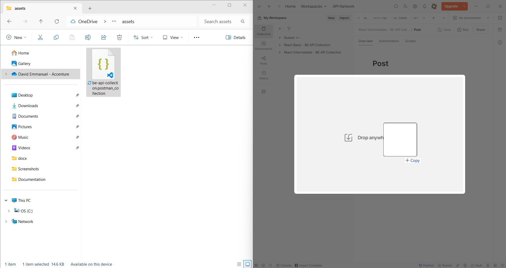
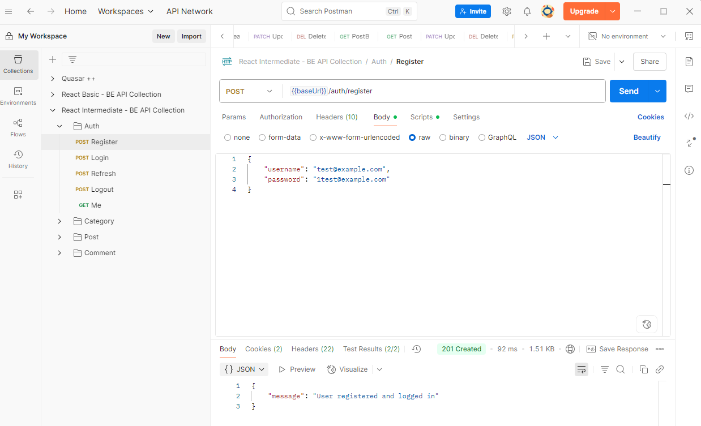

# React Intermediate - Backend API

## Overview

This project is a Node.js backend API for managing posts, categories, comments, and user authentication. It uses Express, lowdb (local JSON database), JWT authentication, and is designed for learning and rapid prototyping.

---

## Features

- User registration and login with JWT authentication
- CRUD operations for posts, categories, and comments
- Organized codebase with controllers, routes, and models
- Ready-to-import Postman collection for testing
- Well-commented source code for easy understanding

---

## Getting Started

### 1. Clone the repository

```bash
# Replace <your-branch> with your branch name
git clone <repo-url>
cd react-intermediate
```

### 2. Install dependencies

```bash
npm install
```

### 3. Environment Variables

Create a `.env` file in the root directory with the following content:

```
ACCESS_TOKEN_SECRET=yourAccessTokenSecret
REFRESH_TOKEN_SECRET=yourRefreshTokenSecret
MONGO_URL=mongodb://localhost:27017/your_db_name
```

> **Note:** Use strong secrets for production. For local development, any string will work.

### 4. Run the backend

```bash
npm run dev
```

The server will start at `http://localhost:3001`.

---

## API Endpoints

All endpoints are prefixed with `/api/`.

### Auth

- `POST /api/auth/register` - Register a new user
- `POST /api/auth/login` - Login and receive tokens
- `POST /api/auth/refresh` - Refresh access token
- `POST /api/auth/logout` - Logout user
- `GET /api/auth/me` - Get current user info

### Category

- `GET /api/categories` - List all categories
- `GET /api/categories/:id` - Get category by ID
- `POST /api/categories` - Create category
- `PATCH /api/categories/:id` - Update category
- `DELETE /api/categories/:id` - Delete category

### Post

- `GET /api/posts` - List all posts
- `GET /api/posts/:id` - Get post by ID
- `POST /api/posts` - Create post
- `PATCH /api/posts/:id` - Update post
- `DELETE /api/posts/:id` - Delete post
- `GET /api/posts/category/:category` - Get posts by category
- `POST /api/posts/:id/comments` - Add comment to post

### Comment

- `GET /api/comments/:id` - Get comments for a post

---

## Testing with Postman

1. Open Postman and click "Import".
   

2. Select the file: `assets/be-api-collection.postman_collection.json`.
3. The collection is organized by controller (Auth, Category, Post, Comment).
4. Use the provided requests and tests to validate your API.
5. Set the environment variable `baseUrl` to `http://localhost:3001/api` if needed.

---

## Authentication Flow

- Register or login to receive `accessToken` and `refreshToken` cookies.
  

- Use these tokens for authenticated requests.
- Use `/api/auth/refresh` to renew your access token.
- Use `/api/auth/logout` to clear tokens.

---

## Project Structure

```
react-intermediate/
├── src/
│   ├── config/         # CORS and other configs
│   ├── controllers/    # Business logic for each resource
│   ├── middleware/     # Auth and error handling
│   ├── models/         # Data access and types
│   ├── routes/         # API endpoints
│   └── index.ts        # App entry point
├── assets/             # Postman collection and images
├── db-*.json           # Local database files
├── .env                # Environment variables
├── package.json        # Project metadata
```

---

## Troubleshooting

- **500 Internal Server Error:** Check your `.env` secrets and restart the server.
- **401 Unauthorized:** Make sure to login and send the correct cookies.
- **CORS errors:** Ensure your frontend is listed in `src/config/corsConfig.ts`.
- **Database issues:** The project uses local JSON files (`db-*.json`). If you delete them, new ones will be created automatically.

---

## Contributing & Learning

- Read the comments in each source file to understand the logic.
- Try modifying endpoints and see how the backend responds.
- Use the Postman tests to validate your changes.

---

## License

MIT

---

## Contact

For questions, reach out to your mentor or open an issue in the repository.
